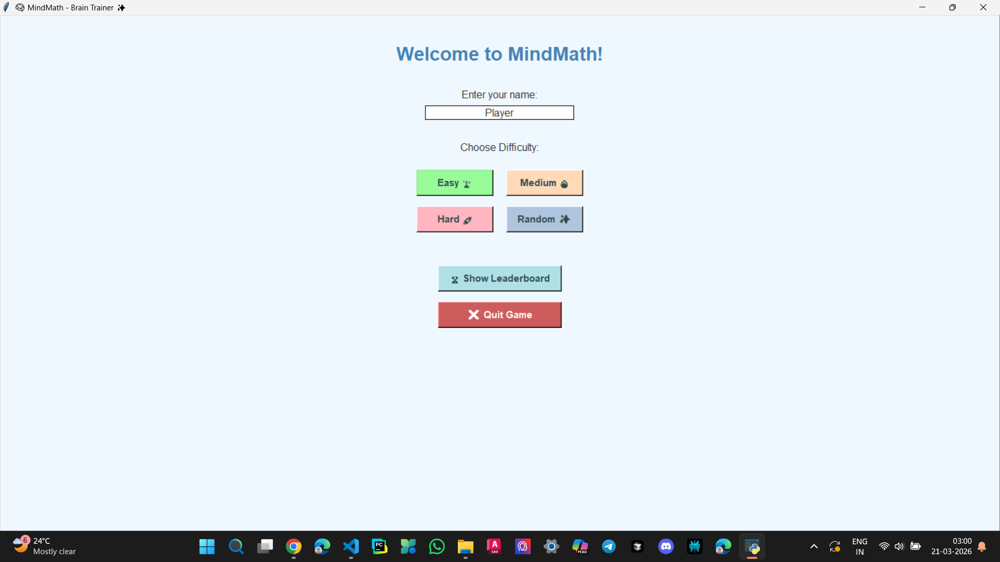
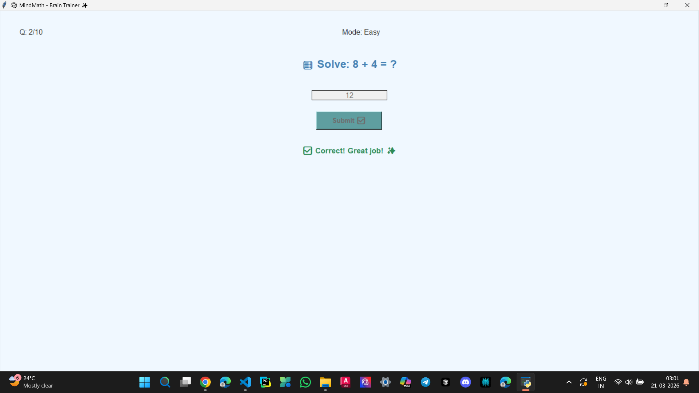
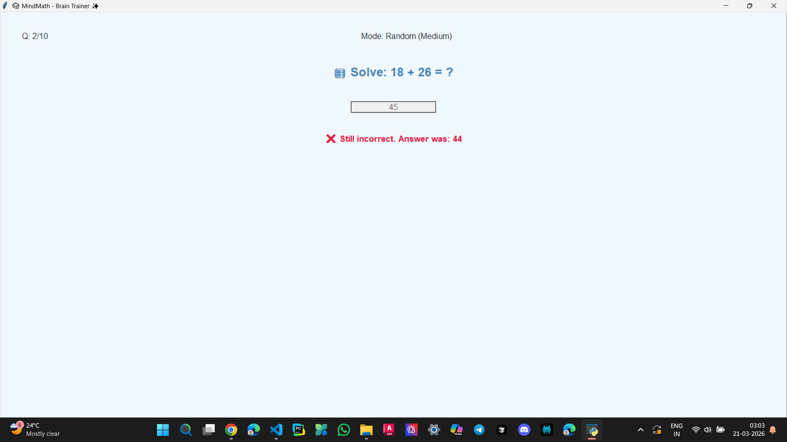
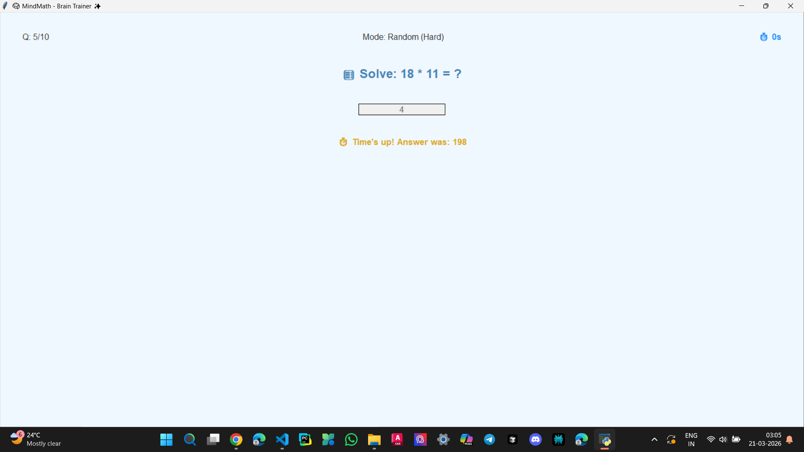
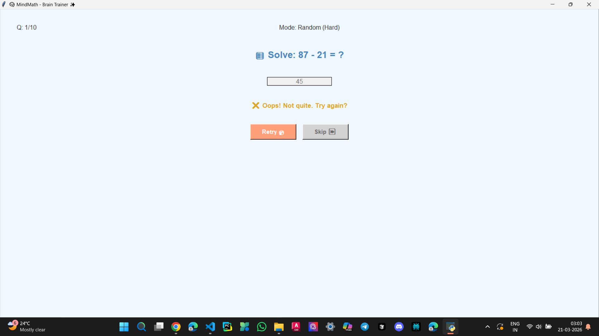
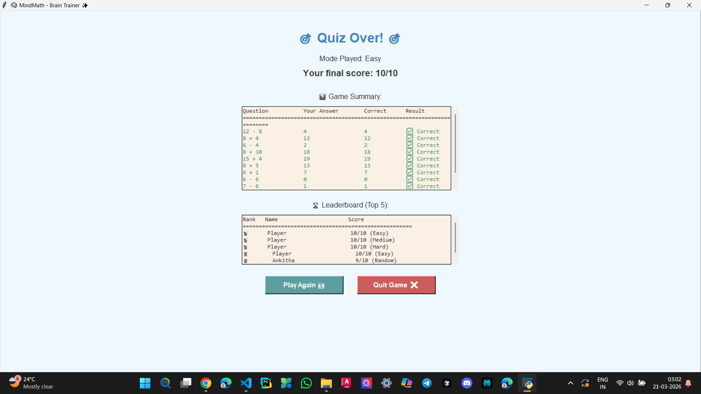
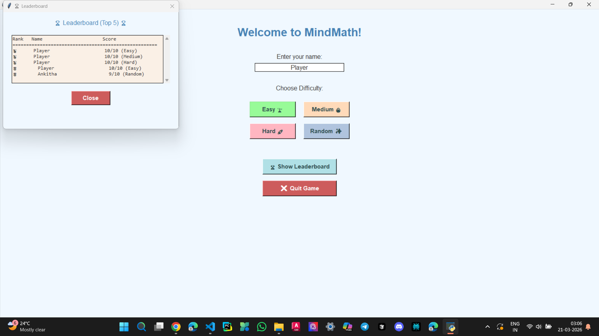

# 🏆 **Achievement:** Secured 2nd Place at CodeStorm 2K25 Hackathon

# 🧠 MindMath - Brain Trainer

A Python Tkinter-based desktop application to improve mental math skills through interactive quizzes.

---

## 🚀 Features

- Multiple difficulty levels (Easy, Medium, Hard, Random)
- Timer-based questions
- Instant feedback (correct/incorrect)
- Retry & Skip options
- Leaderboard system
- Game summary at the end
- Clean GUI

---

## 🛠 Tech Used

- Python
- Tkinter
- File Handling

---

## ▶️ How to Run

python main.py

## 📸 Screenshots

### 🏠 Home Screen

### 🎮 Game Screen

### ❌ Incorrect Answer Feedback

### ⏱️ Time Up

### 🔁 Retry Option

### 📊 Results Screen

### 🏆 Leaderboard

⚠️ Note

This project is developed for learning purposes

Data is stored using text files
